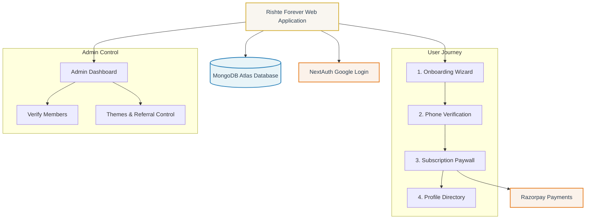

# Rishte Forever — Matrimonial Site Project Notes

This file tracks the approved decisions, architecture, system design, business rules, and phase progress for the Rishte Forever Matrimonial Site.

---

## 1. Project Overview & Target Audience
* **Project Name**: Rishte Forever
* **Core Value Proposition**: A secure, trusted, Shariah-compliant Muslim matrimonial platform with manual verification, privacy controls, and premium personalized match-making packages.
* **Key Targets**: Muslim community looking for marriage, with dedicated options for general, second-marriages, and high-profile individuals.

---

## 2. Approved Business Rules & Pricing Models
| Package / Service | Cost (Excl. GST) | GST (18%) | Total Price | Billing Cycle / Milestones | Details |
| :--- | :--- | :--- | :--- | :--- | :--- |
| **Standard Monthly Membership** | ₹300 | ₹54 | ₹354 | Monthly | Mandatory to view unblurred photos & phone numbers, search, and access standard matches. |
| **Good Profiles Package** | ₹500 | ₹90 | ₹590 | Monthly | Access to curated profiles, valid for 1 year. |
| **Second-Marriage Profiles** | ₹600 | ₹108 | ₹708 | Monthly | Separate private category, valid for 1 year. |
| **High-Profile Matches** | ₹800 | ₹144 | ₹944 | Monthly | For doctors, engineers, business owners, or income > ₹10 LPA. Valid for 1 year. |

### Operational Rules
* **GST Rate**: 18% (to be added dynamically to all transactions on Razorpay).
* **Referral Commission**: Adjustable admin setting between 20% and 23%.
* **Verification**: Manual phone-call verification required for all profiles before they appear in search.
* **Privacy**: Photos and phone numbers must be blurred/hidden for non-logged-in and non-paid users.

---

## 3. Technology Stack & Architecture
* **Frontend**: Next.js 16 (App Router) with TypeScript
* **Backend & API**: Next.js Server Components & Route Handlers
* **Database**: MongoDB Atlas accessed via Prisma ORM (bundled sample profiles are served as a read-only showcase fallback if the database is unreachable or unseeded)
* **Authentication**: Google OAuth 2.0 via Auth.js v5
* **Payment Gateway**: Razorpay (cryptographic signature verification; checkout is disabled if live keys are not configured)
* **Styling**: Vanilla CSS (Design tokens, Custom variables)

### Project Mind Map

---

## 4. Site Map & Core Modules
* **Core Public App**: Landing Page, Search & Directory, Interactive Paywall blurs.
* **Onboarding Module**: Profile Registration Form, verification status locks.
* **Admin Dashboard**: Member Verification & Call Logs, Referral configurations, Custom Color Theme mappings.
* **Payment Integration**: Razorpay order creation & signature verification, dynamic invoice builder (dynamic 18% GST).
* **Vendor Marketplace**: Vendor directory, ratings & category listing.

---

## 5. Development Phase & Progress Tracker
- [x] Phase 1: Foundation, Auth & Profile Setup
- [x] Phase 2: Database Setup, Google Authentication, and Manual Verification Flow
- [x] Phase 3: Subscription, Razorpay (₹300 Standard Package & dynamic theme application)
- [/] Phase 4: Premium Packages (Curated, Second-Marriage, High-Profile) [In Progress]
- [ ] Phase 5: Referral System & Marketplace
- [x] Phase 6: Admin Panel Call Queue (Verification Dashboard, Referral configuration, Theme Management)
- [ ] Phase 7: Full Admin Premium Controls, Polish & Final Launch Prep [In Progress]

---

## 6. Decision Log & Change History
* **2026-06-13**: Project initiated. Structure for `PROJECT_NOTES.md` established.
* **2026-06-13**: Approved tech stack finalized. Phase 1 completed.
* **2026-06-13**: Phase 2 completed. Configured Prisma ORM with Neon PostgreSQL schema, implemented Auth.js v5 route endpoints, developed a 5-step registration wizard with validations, built admin call verification queue with audit logs, and integrated a transparent server-side simulator fallback mechanism. Linting & production build validated.
* **2026-06-13**: Phase 2.5 completed. Conducted comprehensive static security audit and code path verification for database connectivity, OAuth flow, onboarding validation, verification queue, and privacy filters. Prepared full integration guides for production environments. Code linting and Next.js production builds verified clean.
* **2026-06-13**: Phase 3 completed. Added payment order creation and signature verification routes for Razorpay, implemented standard ₹300 monthly membership with dynamic 18% GST (₹54), added viewer subscription checks to redact profile details, integrated frontend checkout loader, and verified builds/lints cleanly.
* **2026-06-13**: Complete Frontend Redesign completed. Redesigned layout to use a premium marriage-card invitation aesthetic with soft cream backgrounds, Islamic geometric SVG patterns, and 8 controlled themes. Added sections for How It Works, Testimonials, Safety, Referrals, and Wedding Services. Refined profile preview cards, details modal, mobile navigation drawer, and onboarding registration steps. Validated code and verified builds compile and lint cleanly.
* **2026-06-13**: Database backend migrated from Neon/PostgreSQL to MongoDB Atlas. Updated schema to conform to MongoDB ObjectIds and mapped relations. Configured connection status health check for MongoDB. Integrated production/preview fallback store safeguards and sanitized database exceptions. Validated builds and linting.
* **2026-07-08**: Removed the demo/simulator system entirely. Deleted the `DemoSimulatorBar`, the "Continue as Demo User" / "Enter as Demo Admin" shortcuts, and the chatbot "Demo Mode" indicator. Renamed the global `SimulatorContext` to `AppContext` (provider `AppProvider`, hook `useApp`). Stripped all `x-simulator-*` request headers and `NEXT_PUBLIC_DEMO_MODE` gating from every API route — access now relies solely on real Auth.js sessions (admin requires an `ADMIN` role). Removed the Razorpay simulator/mock checkout fallback (checkout requires live keys). Bundled sample profiles are retained as a read-only showcase fallback (renamed `sampleProfiles`, "Demo:" name prefixes removed). Type-check, lint, and production build verified clean.

